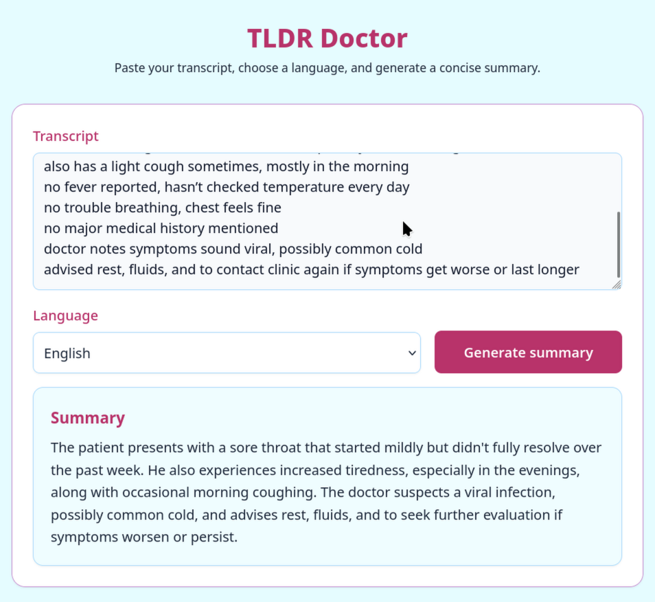

# TLDR Doctor

TLDR Doctor is a small web application that summarizes medical transcripts into a concise single paragraph using a locally hosted language model via the backend API. Paste text, pick a language, and get a short summary.



## Features
- Summarization of pasted transcripts into a short paragraph
- Language selection for output
- Summary persists across page refresh using browser local storage

Supported languages: English, Finnish, Dutch, Swedish.

## Local Setup (no deployment)
This project runs fully on your machine: a Fastify backend API and a Vite-based Vue frontend.

### Backend
From the `api/` directory:

#### Installs all Node dependencies
```sh
npm install
```

#### Starts the development server with hot reload
```sh
npm run dev
```

#### Builds a production bundle
```sh
npm run build
```

#### Locally previews the production build
```sh
npm run preview
```

### Frontend
From the `frontend/` directory:

#### Installs all Node dependencies
```sh
npm install
```

#### Compiles TypeScript to JavaScript
```sh
npm run build
```

#### Starts the built server
```sh
npm start
```

#### Starts dev mode with file watching
```sh
npm run dev
```


## Notes
- The frontend communicates with the backend over HTTP.
- The last generated summary is restored after refresh via `localStorage`; pressing the Summarize button creates a new summary and updates the stored value.
